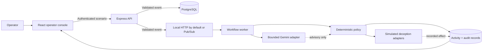

<div align="center">

<picture>
  <source media="(prefers-color-scheme: dark)" srcset="assets/branding/false-route-fox-logo-reversed.svg" />
  <source media="(prefers-color-scheme: light)" srcset="assets/branding/false-route-fox-logo.svg" />
  
</picture>

### A safe, explainable demonstration of intrusion response—without changing customer or production systems.

[Architecture](#architecture) · [Local setup](#local-development) · [Scenarios](#scenario-catalog) · [Security](#security-boundaries) · [Quality gates](#quality-gates)


[](LICENSE)

</div>

---

## Project description

FalseRoute shows how a security team can review a suspicious event and choose a response. It uses fictional attack data, records why each decision was made, and shows the complete process in a dashboard.

AI may suggest a response, but the application's own rules make the final decision. Actions such as creating a decoy, redirecting activity, or blocking a source are simulated by default. FalseRoute does not control customer traffic or production systems.

## How it works

1. An operator chooses a fixed synthetic scenario.
2. The API validates and records the event.
3. The worker evaluates the evidence using deterministic application policy.
4. Gemini can add analysis and recommend actions from a closed tool catalog, but it cannot authorize them.
5. The dashboard shows the evidence, decision, activity, and recorded effect, including failures and degraded states.

### Terms used in this README

| Term                       | Plain-language meaning                                                                                                    |
| -------------------------- | ------------------------------------------------------------------------------------------------------------------------- |
| **Control plane**          | The part of a system that coordinates decisions and records what happened.                                                |
| **Synthetic scenario**     | Fictional test data created to imitate a security event safely.                                                           |
| **Decoy**                  | A simulated resource designed to attract or observe activity in the demonstration.                                        |
| **False route**            | A recorded simulated assignment that represents where activity could be sent; it is not a real network redirect.          |
| **Deterministic policy**   | Explicit application rules that produce a predictable decision from the available evidence.                               |
| **Bounded AI assistance**  | AI used within strict limits: it can advise, but it cannot choose arbitrary tools, resources, identities, or credentials. |
| **Provenance**             | A record of where a value came from and whether it was observed, calculated, inferred, or unavailable.                    |
| **At-least-once delivery** | A message may arrive more than once, so the system must safely recognize duplicates.                                      |

## What it does

| Capability                       | What you get                                                                             |
| -------------------------------- | ---------------------------------------------------------------------------------------- |
| **Scenario injection**           | Fixed, validated intrusion presets instead of arbitrary payloads                         |
| **Deterministic policy**         | One application-owned decision for every response action                                 |
| **Bounded AI assistance**        | Gemini can enrich evidence and recommend from a closed tool catalog                      |
| **Durable workflow state**       | PostgreSQL-backed events, decisions, retries, leases, and audit records                  |
| **Live operator console**        | React dashboard with event activity, decisions, and streaming updates                    |
| **Failure-aware execution**      | Timeouts, bounded retries, concurrency limits, degraded states, and redacted diagnostics |
| **Cloud deployment definitions** | API, worker, and Web services packaged for Cloud Run with Secret Manager references      |

## What it deliberately does not do

- It does not proxy real customer traffic.
- It does not execute arbitrary model-generated commands.
- It does not let Gemini choose cloud resources, identities, destinations, or credentials.
- It does not claim exactly-once message delivery.
- It does not turn a simulated route assignment into a real containment action.
- It is not production-ready by default; live cloud effects are not implemented or enabled.

## Architecture



Local development uses authenticated loopback HTTP between the API and worker. This keeps setup small while exercising the same validated push boundary. The staging infrastructure definitions support Google Cloud Pub/Sub with at-least-once delivery.

### The important boundary

FalseRoute treats provider output as untrusted input. The worker validates every model response at the adapter boundary, then deterministic application policy narrows, authorizes, or rejects the recommendation. Provenance remains visible throughout the workflow:

- `OBSERVED` — supplied by the synthetic event or transport.
- `DERIVED` — calculated by deterministic application rules.
- `INFERRED` — advisory model enrichment.
- `UNAVAILABLE` — a bounded provider failure or degraded result.

## Scenario catalog

The simulator exposes a fixed catalog. Each preset defines its evidence shape, allowed actions, risk bounds, and negative-control behavior.

| Scenario                      | Demonstrates                                              |
| ----------------------------- | --------------------------------------------------------- |
| `.env` configuration probe    | Web decoy recommendation and false-route simulation       |
| WordPress configuration probe | Template-specific deception policy                        |
| Suspicious IP burst           | Bounded alert and quarantine recommendation               |
| SIP INVITE flood              | Telemetry and policy evaluation without SIP proxying      |
| Administrative token tamper   | Rejection, alerting, and bounded quarantine behavior      |
| Path traversal probe          | Evidence validation and web decoy response                |
| Decoy credential use          | Canonical `mock-admin-decoy` assignment in simulated mode |
| SQL injection probe           | Bounded detection evidence and an alert decision          |
| Cloud metadata SSRF probe     | Mandatory rejection and alert decisions                   |
| Credential stuffing burst     | Correlated login failures, rejection, and alert decisions |

## Local development

### Prerequisites

- Node.js `24.19.0` — see `.nvmrc`
- pnpm `11.22.0`
- Docker Desktop with Docker Compose

### Start the project

```bash
pnpm install
cp .env.example .env
pnpm dev:infra
pnpm dev:migrate
pnpm dev
```

Then open [http://localhost:5173](http://localhost:5173).

The committed environment example is local-only and uses unmistakably synthetic values. It does not contain production credentials. The default local database is exposed on port `5434`; the Web app runs on `5173`, the API on `3000`, and the worker health server on `8088`.

To stop the stack:

```bash
pnpm dev:infra:down
```

### Try the workflow

1. Unlock the console with the synthetic local operator token from `.env.example`.
2. Open the scenario simulator.
3. Select a fixed preset such as **Decoy Credential Trigger**.
4. Submit the event.
5. Follow the event from ingestion to decision in the activity stream.

### Run one service at a time

| Command               | Purpose                       |
| --------------------- | ----------------------------- |
| `pnpm dev:web`        | Start the Web dashboard       |
| `pnpm dev:api`        | Start the API                 |
| `pnpm dev:worker`     | Start the worker              |
| `pnpm dev:services`   | Start API and worker together |
| `pnpm dev:migrate`    | Run guarded local migrations  |
| `pnpm dev:infra`      | Start local PostgreSQL        |
| `pnpm dev:infra:down` | Stop local PostgreSQL         |

## Repository map

```text
apps/
├── api/                  Express control-plane API
├── web/                  React + Vite operator dashboard
└── worker/               Event processor, policy engine, and adapters

packages/
├── config/               Typed environment parsing
├── contracts/            Canonical Zod contracts and scenario catalog
├── database/             Prisma schema, migrations, and repositories
├── observability/        Pino logging and OpenTelemetry boundaries
├── security/             Authentication and IAM policy rules
└── typescript-config/    Shared strict TypeScript configuration

infrastructure/
├── cloud-run/            Declarative Cloud Run templates
├── docker/               Local PostgreSQL infrastructure
└── terraform/            Staging infrastructure modules

tests/integration/        Cross-application integration coverage
```

## Technology

- **Runtime:** Node.js 24, TypeScript, pnpm, Turborepo — runs the application and manages the monorepo.
- **API:** Express 5 — receives validated requests and exposes the control-plane endpoints.
- **UI:** React 19, Vite, Vitest — builds the operator dashboard and tests the Web experience.
- **Contracts:** Zod schemas with shared typed boundaries — checks that data has the expected shape before it moves between services.
- **Persistence:** PostgreSQL, Prisma 7 — stores events, decisions, retries, leases, and audit records durably.
- **Event transport:** Authenticated loopback HTTP is the local default; Google Cloud Pub/Sub provides at-least-once delivery in the staging configuration.
- **AI adapter:** Gemini through a bounded provider boundary — adds optional analysis while application policy remains in control.
- **Deployment:** Cloud Run, Artifact Registry, Cloud SQL, Secret Manager, Terraform — defines how the services are packaged and configured for Google Cloud.
- **Observability:** Pino and OpenTelemetry interfaces — make service activity and failures easier to inspect.

## Security boundaries

Security is part of the workflow rather than a later layer. FalseRoute applies:

- Authentication and authorization at API boundaries.
- Strict scenario and evidence validation.
- Closed tool catalogs with deterministic authorization.
- Secret Manager references for deployed runtime secrets.
- Redacted logs and bounded error details.
- Application-level rate, size, concurrency, retry, timeout, and spend controls.
- Non-root, production-oriented container verification.
- Explicit ownership and provenance for derived decisions.

Please do not report a vulnerability in a public issue. Use a private security report through the repository’s GitHub security reporting channel.

## Quality gates

Run the composite check before opening a change:

```bash
pnpm check
```

Useful focused checks:

```bash
pnpm test
pnpm test:integration
pnpm verify:containers
pnpm check:templates
pnpm check:secrets
pnpm check:docs
```

The repository also runs these checks in GitHub Actions. Two separate staging workflows cover deployment:

- The application workflow builds the three `linux/amd64` service images, publishes immutable image digests, runs database migrations, and updates existing Cloud Run services.
- The manually started infrastructure workflow creates a Terraform plan and applies it only after approval through the configured GitHub environment.

## Documentation

- [Architecture overview](docs/architecture/overview.md)
- [Threat model](docs/architecture/threat-model.md)
- [Engineering principles](docs/architecture/engineering-principles.md)
- [Quality gates](docs/architecture/quality-gates.md)
- [Frontend architecture](docs/architecture/frontend.md)

## License

This project is licensed under the [MIT License](LICENSE).

## Project status

FalseRoute is an active engineering implementation. The local workflow, policy engine, event processing, operator console, contracts, tests, and staging infrastructure definitions are present. Real decoy deployment, traffic routing, and source quarantine are not implemented or enabled. Adding them would require separate implementation, activation evidence, and approval. Production hardening and browser-level certification are also unfinished work, not implied guarantees.

If you are evaluating the project, start with the local quickstart and the [architecture overview](docs/architecture/overview.md). If you are changing a trust boundary, provider adapter, persistence rule, or deployment boundary, read the [engineering principles](docs/architecture/engineering-principles.md) and [quality gates](docs/architecture/quality-gates.md) first.

<div align="center">

Built for transparent security engineering: bounded authority, durable evidence, and no magic containment claims.

</div>
