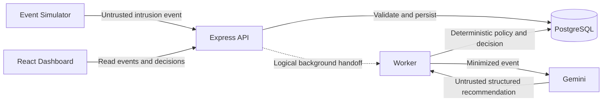

# Architecture Overview

> **Status: Approved for initial implementation**  
> **Approved:** August 21, 2026

FalseRoute begins as a TypeScript monorepo with separate Web, API, and Worker applications. Shared packages own contracts, persistence, configuration, security, and observability concerns. The first architecture proves one simulated intrusion-to-deception workflow without introducing a real network agent.

## Initial Logical Flow

The diagram is logical. The asynchronous delivery mechanism between the API and Worker remains deferred until delivery, retry, ordering, and latency requirements are documented. Redis or a queue must not be introduced merely to complete this diagram.

## Component Boundaries

### Web

- Presents intrusion events, indicators, matched policies, model explanations, decisions, false routes, simulated effect evidence, and processing status.
- Calls the API through shared contracts.
- Uses truthful product language (`"Simulated assignment recorded"`, `"RECORDED"`, `"No real traffic or infrastructure change occurred"`) and avoids misleading execution terminology.
- Never accesses PostgreSQL or Gemini directly.

### API

- Accepts untrusted simulator and operator requests.
- Validates request and response data with shared Zod contracts.
- Coordinates application services and persistence through explicit route, controller, service, and repository boundaries.
- Exposes event, decision, simulated effect evidence, health, and readiness interfaces.

### Worker

- Enriches validated events with Gemini.
- Treats model output as untrusted structured data.
- Applies deterministic policy and action-allowlist validation.
- Records the deception decision, audit information, degraded model status when applicable, and invokes the constrained simulated deception agent adapter for `ASSIGN_FALSE_ROUTE` decisions to record `RECORDED` simulated effect evidence.

### Shared Packages

- `contracts`: event, model-output, decision, simulated deception effect, and API schemas
- `database`: Prisma schema, migrations, CHECK constraints, and client ownership
- `config`: typed environment configuration
- `security`: shared security boundaries as concrete needs emerge
- `observability`: Pino logging and OpenTelemetry interfaces
- `typescript-config`: shared strict TypeScript configurations

## Approved First Policy

Use of a known decoy credential deterministically produces an `ASSIGN_FALSE_ROUTE` decision for `mock-admin-decoy` in `SIMULATED` mode, recording an atomic `RECORDED` simulated deception effect in the database. Gemini supplies bounded enrichment and may recommend only an application-defined action. Application code owns the final decision and cannot execute model-generated commands or arbitrary destinations.

## Failure Behavior

- Invalid API input is rejected before processing.
- Invalid or unsafe Gemini output is rejected and audited.
- Gemini timeout or unavailability produces a degraded model result; the deterministic safe policy remains available.
- No failure path may convert simulated containment into a real infrastructure action.
- Retry and idempotency behavior must be defined before public or production deployment.

## Initial Google Architecture

- **Hackathon track:** The Taskmaster
- **AI:** Gemini 3.5 or newer through the Google Gen AI SDK for TypeScript
- **Compute:** Cloud Run for the initial deployable services
- **Database:** Cloud SQL for PostgreSQL
- **Telemetry:** Pino and OpenTelemetry, exported to Google Cloud during production hardening

The Web hosting shape and the Worker delivery mechanism can be refined during deployment design without changing the approved application boundaries.

## Deferred Architecture

The initial implementation excludes a privileged deception agent, real traffic routing, host access, packet processing, Redis, and an automatically selected queue. These require documented operational and security requirements before introduction.

Security boundaries and non-goals are detailed in the [initial threat model](threat-model.md). Repository-wide boundaries and commenting rules are defined in the [engineering principles](engineering-principles.md), and Web-specific organization is defined in the [frontend architecture](frontend.md).
