# Architecture Overview

> **Status:** Approved architecture; ADR-0005 accepted; live cloud mutation not activated
> **Approved:** August 21, 2026
>
> **Last verified:** August 25, 2026

FalseRoute is a TypeScript monorepo with separate Web, API, and Worker applications. Shared packages own contracts, persistence, configuration, security, and observability. The current implementation processes a fixed catalog of synthetic security scenarios through an autonomous response workflow while keeping all Cloud Run decoy, traffic-routing, and Cloud Armor effects simulated.

## Logical Flow and Autonomous Control Plane

```mermaid
flowchart LR
    Operator[Operator] -->|Authenticated synthetic scenario| API[Express API]
    API -->|Validated event envelope| Transport[Local transport or Pub/Sub]
    Transport -->|Authenticated push| Worker[Worker orchestrator]
    Worker -->|Bounded event and context| Gemini[Gemini adapter]
    Gemini -->|Structured requests from a closed catalog| Policy[Deterministic policy]
    Policy -->|Authorized and narrowed actions| Gateway[Tool gateway]
    Gateway --> Simulated[Simulated Cloud Run / false-route / Cloud Armor adapters]
    Worker -->|Workflow state, leases, and audit| DB[(PostgreSQL)]
    Gateway -->|Operation ledger and activity| DB
    DB -->|Ordered activity events| SSE[Authenticated SSE stream]
    SSE --> Dashboard[React operator console]
    Cleanup[Lease cleanup] -->|Release expired simulated resources| Gateway
```

An operator chooses one of the fixed scenarios exposed by the shared scenario catalog. The API validates the request, creates a versioned event envelope, and publishes it through the configured transport. Local development can use a loopback HTTP transport or the Pub/Sub emulator. The API and Worker also contain real Google Pub/Sub publisher and authenticated push adapters for a controlled Google Cloud environment.

The Worker validates the envelope and its scenario-specific evidence, builds bounded incident context, and asks Gemini for structured analysis when a Gemini key is configured. Gemini can request only the five tools defined by ADR-0005. Deterministic application policy then rejects, narrows, or authorizes those requests. The model never owns the final decision and never receives cloud credentials.

The authorized action path is implemented through a durable tool gateway, but the current Cloud Run decoy, false-route, and Cloud Armor adapters are simulations. They record simulated resources, leases, provider intent, results, and cleanup evidence without changing cloud infrastructure or customer traffic. Live cloud mutation has not been implemented, verified, or activated. Under accepted ADR-0005, all live cloud mutations remain disabled until activation evidence and an operator activation record are complete.

## Component Boundaries

### Web

- Provides the operator sign-in, scenario controls, event and campaign views, decisions, tool outcomes, leases, and ordered activity history.
- Calls the API through shared contracts and consumes its authenticated Server-Sent Events stream.
- Distinguishes observed, derived, inferred, unavailable, and simulated information.
- Uses explicit labels for simulated effects and does not claim that traffic or infrastructure changed.
- Never accesses PostgreSQL, Pub/Sub, Gemini, or cloud-provider APIs directly.

### API

- Authenticates operator requests using the configured bearer credential or a signed operator session.
- Requires a session-bound CSRF token for state-changing requests authenticated by cookie.
- Validates untrusted request and response data with shared Zod contracts.
- Publishes validated event envelopes through an in-memory, local HTTP, Pub/Sub emulator, or authenticated Google Pub/Sub adapter, depending on configuration.
- Exposes event, decision, activity, dead-letter replay, emergency-release, campaign, health, and readiness interfaces.
- Streams database-backed activity through authenticated SSE with resumable cursors, bounded catch-up, heartbeats, and connection limits.
- Keeps routing, controllers, application services, repositories, and integrations as separate responsibilities.

### Worker

- Accepts local authenticated pushes, Pub/Sub emulator pushes, or Google Pub/Sub pushes with verified OIDC audience and service identity.
- Validates the transport envelope, event schema, scenario evidence, and size limits before orchestration.
- Builds bounded incident context and treats all Gemini output as untrusted provider data.
- Applies deterministic scenario policy, including mandatory rules and negative controls, before any tool request can proceed.
- Runs authorized actions through the tool gateway, records ordered activity, and creates time-limited simulated resource leases.
- Provides bounded lease cleanup, provider-intent reconciliation, campaign progression, and durable dead-letter intake.
- Returns a retriable failure for transient processing errors so Pub/Sub can redeliver; poison messages are durably quarantined and acknowledged only after that record succeeds.

### Tool Gateway and Effect Adapters

- The closed model-request catalog is `recommend_response_plan`, `request_decoy_deployment`, `request_false_route_assignment`, `request_source_quarantine`, and `request_operator_alert`.
- Application policy owns authorization and may replace model parameters with safe values from the scenario catalog.
- Durable budget reservations, operation records, provider intents, ownership tokens, and fencing checks protect expensive or harmful boundaries.
- The current Cloud Run, false-route, and Cloud Armor adapters maintain simulated inventories and return `SIMULATED` results.
- Cleanup and emergency release remove or revoke only resources owned by the matching simulated operation.
- There is no active adapter that deploys a Cloud Run decoy, changes a route, or changes a Cloud Armor policy.

### Shared Packages

- `contracts`: versioned event, scenario, Gemini, tool, workflow, activity, lease, campaign, and API schemas
- `database`: Prisma schema, migrations, repositories, durable claims, constraints, and transaction ownership
- `config`: typed environment configuration
- `security`: authentication helpers and shared security boundaries
- `observability`: Pino logging and OpenTelemetry interfaces
- `typescript-config`: shared strict TypeScript configurations

## Scenario and Policy Model

The shared catalog contains ten fixed synthetic scenarios, including configuration probes, suspicious request bursts, credential misuse, path traversal, SQL injection, cloud metadata access, and credential stuffing. Each scenario owns validated evidence, allowed actions, limits, and positive and negative controls.

Gemini provides bounded analysis and may request only application-defined actions. Deterministic policy compares those requests with the validated event and scenario catalog. For example, use of the known fictional decoy credential still requires a simulated assignment to `mock-admin-decoy`, even when Gemini is unavailable or recommends something else. Negative-control events cannot trigger active response actions.

## Delivery, Retry, and Idempotency

- Pub/Sub delivery is at least once; FalseRoute does not claim exactly-once processing.
- Durable ingestion receipts identify duplicate deliveries by event and transport identity.
- Transient Worker failures return a non-success response so Pub/Sub can apply its configured retry and dead-letter behavior.
- Invalid envelopes and poison payloads are durably quarantined before they are acknowledged.
- Exhausted broker deliveries are stored for authenticated inspection and controlled replay.
- Gemini calls have full-operation deadlines, bounded retries with jitter, concurrency and queue limits, and durable per-event and daily token budgets.
- Tool operations use deterministic idempotency keys, durable reservations, provider-intent claims, ownership tokens, and fencing versions.
- An uncertain provider outcome is reconciled against the operation-specific simulated inventory before a retry may complete the record. A retry repairs missing projections instead of repeating an already recorded effect.
- Resource leases have bounded lifetimes and cleanup attempts are fenced so overlapping workers cannot both own the same cleanup action.

These controls are implemented and covered by focused tests. They apply to the current transports and simulated action providers; they are not evidence that live cloud mutations are safe or active.

## Failure Behavior

- Invalid API input and unauthorized requests are rejected before workflow processing.
- Invalid, unsafe, over-budget, or low-confidence Gemini output cannot bypass deterministic policy.
- Gemini timeout or unavailability produces an explicit degraded result; deterministic policy remains available.
- Budget, claim, persistence, and reconciliation failures fail closed at the affected action boundary.
- Database-backed state remains the source of truth for workflow, activity, replay, lease, and cleanup status.
- No failure path may convert a requested, recorded, or simulated action into a live infrastructure effect.

## Google Cloud Deployment Architecture

- **Hackathon track:** The Taskmaster
- **AI:** Configurable Gemini model through the Google Gen AI SDK for TypeScript; the repository default is `gemini-3.5-flash`
- **Event transport:** Authenticated Google Pub/Sub publishing and OIDC-authenticated push consumption are implemented alongside local and emulator adapters
- **Compute:** Cloud Run templates for `falseroute-api`, `falseroute-worker`, and `falseroute-web`
- **Database:** Cloud SQL for PostgreSQL
- **Packaging:** Multi-stage production images pinned to `node:24.19.0-bookworm-slim`, running as the non-root `node` user with read-only root filesystem support
- **Telemetry:** Pino and OpenTelemetry interfaces, with cloud export dependent on deployment configuration

The presence of Google Cloud adapters, infrastructure templates, and Terraform does not mean the system has been activated in a live staging environment. Pub/Sub and Gemini have real integration implementations. Cloud Run decoy deployment, false-route assignment, and Cloud Armor mutation remain simulated.

## Runtime Lifecycle and Draining

- **API:** Tracks connections, stops readiness when shutdown begins, closes activity streams, drains sockets within a fixed budget, disconnects PostgreSQL, and flushes telemetry.
- **Worker:** Exposes `/health` and PostgreSQL-backed `/ready`, stops accepting work during shutdown, drains in-flight processing, disconnects PostgreSQL, and flushes telemetry within fixed time budgets.
- **Web:** Serves static assets with security headers, returns bounded JSON for unknown `/api/*` requests, and supports same-origin API routing behind an external HTTPS load balancer.

## Cloud Run Deployment Contracts

- Declarative service templates live in `infrastructure/cloud-run/`.
- API and Worker are limited to one instance while abuse controls and some coordination remain process-local.
- The Worker uses always-allocated CPU, a minimum instance count of one, and explicit startup and liveness probes for continuous background work.
- The API has separate readiness and liveness probes.
- Runtime secrets come from Secret Manager references rather than plain template values.
- Ordinary service startup never runs database migrations; migrations remain a separate guarded operation.

## Safety Boundary and Deferred Architecture

The current release does not deploy temporary Cloud Run decoys, divert traffic, modify Cloud Armor, process packets, access hosts, or contain real attackers. It does not target customer networks or production systems. All displayed decoy, route, quarantine, cleanup, and release effects are simulated records.

ADR-0005 defines the controls required for a future bounded staging mode, but accepting that ADR did not activate live effects. Live adapters require separate implementation, dedicated Google Cloud resources, completed activation evidence, operator approval, rollback evidence, and verification against the threat model. Distributed cross-instance rate and concurrency controls and browser-based Playwright end-to-end verification also remain deferred.

Security boundaries and non-goals are detailed in the [threat model](threat-model.md). Repository-wide design rules are defined in the [engineering principles](engineering-principles.md), active and deferred checks are listed in [quality gates](quality-gates.md), and Web-specific organization is defined in the [frontend architecture](frontend.md).
