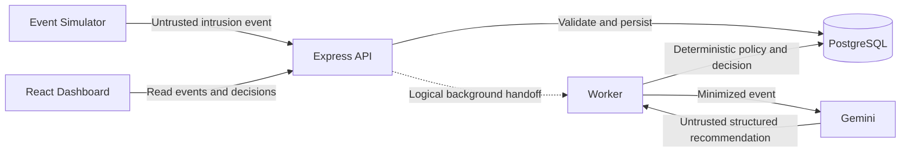

# Architecture Overview

> **Status: Approved for initial implementation**  
> **Approved:** August 21, 2026

FalseRoute begins as a TypeScript monorepo with separate Web, API, and Worker applications. Shared packages own contracts, persistence, configuration, security, and observability concerns. The first architecture proves one simulated intrusion-to-deception workflow without introducing a real network agent.

## Initial Logical Flow

The diagram is logical. The asynchronous delivery mechanism between the API and Worker remains deferred until delivery, retry, ordering, and latency requirements are documented. Redis or a queue must not be introduced merely to complete this diagram.

## Component Boundaries

### Web

- Presents intrusion events, indicators, matched policies, model explanations, decisions, false routes, simulated effect evidence, and processing status.
- Calls the API through shared contracts.
- Uses truthful product language (`"Simulated assignment recorded"`, `"RECORDED"`, `"No real traffic or infrastructure change occurred"`) and avoids misleading execution terminology.
- Never accesses PostgreSQL or Gemini directly.

### API

- Accepts untrusted simulator and operator requests.
- Validates request and response data with shared Zod contracts.
- Coordinates application services and persistence through explicit route, controller, service, and repository boundaries.
- Exposes event, decision, simulated effect evidence, health, and readiness interfaces.

### Worker

- Enriches validated events with Gemini.
- Treats model output as untrusted structured data.
- Applies deterministic policy and action-allowlist validation.
- Records the deception decision, audit information, degraded model status when applicable, and invokes the constrained simulated deception agent adapter for `ASSIGN_FALSE_ROUTE` decisions to record `RECORDED` simulated effect evidence.

### Shared Packages

- `contracts`: event, model-output, decision, simulated deception effect, and API schemas
- `database`: Prisma schema, migrations, CHECK constraints, and client ownership
- `config`: typed environment configuration
- `security`: shared security boundaries as concrete needs emerge
- `observability`: Pino logging and OpenTelemetry interfaces
- `typescript-config`: shared strict TypeScript configurations

## Approved First Policy

Use of a known decoy credential deterministically produces an `ASSIGN_FALSE_ROUTE` decision for `mock-admin-decoy` in `SIMULATED` mode, recording an atomic `RECORDED` simulated deception effect in the database. Gemini supplies bounded enrichment and may recommend only an application-defined action. Application code owns the final decision and cannot execute model-generated commands or arbitrary destinations.

## Failure Behavior

- Invalid API input is rejected before processing.
- Invalid or unsafe Gemini output is rejected and audited.
- Gemini timeout or unavailability produces a degraded model result; the deterministic safe policy remains available.
- No failure path may convert simulated containment into a real infrastructure action.
- Retry and idempotency behavior must be defined before public or production deployment.

## Initial Google Architecture

- **Hackathon track:** The Taskmaster
- **AI:** Gemini 3.5 or newer through the Google Gen AI SDK for TypeScript
- **Compute:** Cloud Run for the deployable services (`falseroute-api`, `falseroute-worker`, `falseroute-web`)
- **Packaging:** Multi-stage production container images pinned to `node:24.19.0-bookworm-slim`, running under a dedicated non-root user (`node`, UID 1000) with read-only root filesystem support and exec-form commands.
- **Database:** Cloud SQL for PostgreSQL
- **Telemetry:** Pino and OpenTelemetry, exported to Google Cloud during production hardening

## Runtime Lifecycle & Draining

- **API Lifecycle:** Implements connection tracking (`Set<Socket>`), graceful `SIGTERM`/`SIGINT` handling, immediate `503 SERVICE_UNAVAILABLE` signaling on unauthenticated `/api/v1/ready` upon shutdown commencement, bounded three-phase graceful shutdown (`SHUTDOWN_DRAIN_TIMEOUT_MS: 5000`, `SHUTDOWN_DB_DISCONNECT_TIMEOUT_MS: 2000`, `SHUTDOWN_TELEMETRY_TIMEOUT_MS: 1000` fitting inside 8000ms `SHUTDOWN_TIMEOUT_MS`), forced socket destruction on drain timeout, database disconnection, and telemetry flushing.
- **Worker Lifecycle:** Operates an internal HTTP health server listening on `0.0.0.0:${PORT}` (port 8080) exposing unauthenticated `/health` (liveness) and `/ready` (PostgreSQL dependency-backed readiness). Halts active polling loops on `SIGTERM`/`SIGINT`, drains in-flight event processing within `WORKER_DRAIN_TIMEOUT_MS: 5000`, safely disconnects database client within `WORKER_DB_DISCONNECT_TIMEOUT_MS: 2000`, and flushes telemetry within `WORKER_TELEMETRY_TIMEOUT_MS: 1000` (bounded by 8000ms `WORKER_SHUTDOWN_TIMEOUT_MS`).
- **Web Lifecycle & Routing:** Serves static frontend assets with strict security headers, rejects non-existent `/api/*` requests with bounded 404 JSON (preventing SPA fallback from returning HTML for API calls), and routes API traffic via same-origin external HTTPS load balancer path routing (`/api/*` -> API service).

## Provisional Cloud Run Deployment Contracts

- **Declarative Templates:** Defined in `infrastructure/cloud-run/` (`api.service.yaml`, `worker.service.yaml`, `web.service.yaml`) using Knative Serving schema.
- **Single-Instance Constraint:** API and Worker enforce `autoscaling.knative.dev/maxScale: "1"` while abuse controls, rate limiting, and claim concurrency remain process-local.
- **Worker CPU Allocation & Health Probes:** Worker template explicitly configures `run.googleapis.com/cpu-throttling: "false"` and `minScale: "1"` to guarantee continuous background polling loops, configuring `startupProbe` (`/ready`) and `livenessProbe` (`/health`) on container port 8080.
- **API Health Probes:** API template specifies `startupProbe` targeting `/api/v1/ready` and `livenessProbe` targeting `/api/v1/health` on port 3000.
- **Zero-Secret Templates:** Secrets (`DATABASE_URL`, `OPERATOR_ACCESS_TOKEN`, `GEMINI_API_KEY`) are resolved via Secret Manager (`secretKeyRef`), never plain environment values.
- **Zero-Auto-Migration:** Service containers do not execute database schema migrations on ordinary startup; schema migrations remain separated and guarded via `scripts/prisma-guard.ts`.

## Deferred Architecture

The initial implementation excludes a privileged deception agent, real traffic routing, host access, packet processing, Redis, distributed cross-instance rate limits, and an automatically selected queue. In-memory rate limiting and overload shedding remain process-local safeguards requiring single-instance deployment until a distributed state layer is introduced. Browser-based Playwright end-to-end verification remains deferred in the local backlog.

Security boundaries and non-goals are detailed in the [initial threat model](threat-model.md). Repository-wide boundaries and commenting rules are defined in the [engineering principles](engineering-principles.md), quality gate activations are listed in [quality gates](quality-gates.md), and Web-specific organization is defined in the [frontend architecture](frontend.md).
